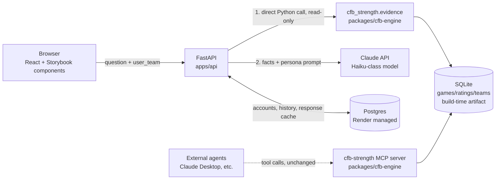

# Architecture Brief — My Team Is Better

Companion to `docs/PRD.md`. Assumes that PRD's scope decisions (structured
questions only, single-shot stateless Q&A, 1998–present, Keener-only for MVP).

Where a decision is explicitly borrowed from `claude-architect/docs/exam-guide.md`,
it's cited inline as `(Domain N.M)` — not because the exam matters here, but
because those task statements are a good compressed checklist for exactly the
deterministic-core/AI-layer boundary this product depends on.

---

## 1. System overview



Two separate consumers of the same engine, on purpose:

- **The web app** already knows exactly which deterministic query it needs
  (the UI picked the question type) — it calls `cfb_strength.evidence`
  functions **directly as a Python import**, no tool-calling round trip.
- **The existing MCP server** (unchanged, still stdio) stays available for
  agentic consumers that genuinely need to *choose* which tool to call —
  Claude Desktop, other agents. Don't collapse these into one path just
  because they wrap the same engine (Domain 2.3: an agent's tool surface
  should match what that agent actually needs to decide, not be maximized).

## 2. Monorepo layout

```
my-team-is-better/
  apps/
    web/            # React + Vite + TS + Storybook (SPA, static build)
    api/             # FastAPI: HTTP endpoints + persona orchestration
  packages/
    cfb-engine/      # cfb-strength-orchestrated, absorbed near-verbatim
      src/cfb_strength/
        ingest/ ratings/ evidence/ mcp_server/ db/ contracts.py config.py cli.py
      .importlinter
      pyproject.toml
  docs/
    PRD.md
    ARCHITECTURE.md
  render.yaml
  pyproject.toml     # uv workspace root
  .github/workflows/ci.yml
```

**uv workspace**, not a separate vendored copy: root `pyproject.toml` declares

```toml
[tool.uv.workspace]
members = ["packages/cfb-engine", "apps/api"]
```

`apps/api` depends on `cfb-strength-orchestrated` as a workspace member (path
dependency, one lockfile). This is why absorbing the engine into the monorepo
(founder's choice over keeping it a separate deployed service) is the right
call for a fast-moving solo project: one CI run, one version of the truth,
and — critically — when the "levers" feature lands later, engine and API
change together in one PR instead of a cross-repo version bump dance.

**Layering stays enforced, just extended.** `apps/api` is a new top-layer
consumer exactly like `cli.py` and `mcp_server/` are today — it may only
import `cfb_strength.evidence` and `cfb_strength.db.connection`, never
`ratings/` or `ingest/` directly. Add a line to `.importlinter` reflecting
this the same way the existing layers contract already separates
`cli`/`mcp_server` from `evidence | ratings | ingest`. `apps/api` living
outside `src/cfb_strength/` means it isn't part of the `import-linter` root
package by default — enforce the boundary by convention (api only imports
from `cfb_strength.evidence.proof` and `cfb_strength.db.connection`, nothing
else) and call it out in code review, since import-linter can't reach across
package boundaries as configured today.

## 3. Data: two stores, two lifecycles

| Store | Contents | Lifecycle | Why |
|---|---|---|---|
| **SQLite** (`cfb-engine`'s existing schema, unchanged) | `teams`, `team_season`, `games`, `ratings`, `ingestion_log` | Built at deploy/ingest time (`uv run cfb ingest --years 1998-2025 && uv run cfb rate`), shipped as a read-only artifact inside the API service | This is reference data — it doesn't change per-request, doesn't need a network round trip, and paying for a managed Postgres instance just to serve read-mostly rankings would be waste for a hobby-budget app. |
| **Postgres** (Render managed) | accounts (via auth provider's user id), favorite team, question history, **persona response cache** | Runtime, mutable, grows with usage | This is genuinely dynamic app state — the one thing that has to be a real database. |

Re-ingestion (new season each year, or a data correction) is a manual/cron
Render job, not something triggered by user traffic — keeps CFBD's 1,000
calls/month free tier comfortably out of the hot path (PRD §8).

## 4. Backend: FastAPI (`apps/api`)

### 4.1 Request flow for a question

1. Client sends `{question_type, year, team | team_a/team_b, user_team}`.
2. API calls the matching `cfb_strength.evidence.proof` function **directly**
   (no MCP, no tool-calling loop) — it already knows exactly which one to
   call because the UI's structured form determined that, not an LLM. Errors
   come back as the contract's existing typed exceptions
   (`UnknownYearError`, `AmbiguousTeamError`, `SameTeamComparisonError`) —
   reuse these as-is rather than inventing new error shapes; they already
   distinguish retryable-shaped problems (bad year → show valid years) from
   genuine input problems (ambiguous team → show candidates), which is
   exactly the distinction Domain 2.2 asks for.
3. API checks the **persona cache** (Postgres) keyed on
   `hash(question_type, year, team(s), user_team, method, prompt_version)`.
   Cache hit → return immediately, no Claude call. This is the single
   biggest cost lever available (PRD §6): the deterministic facts and the
   allegiance are both part of the key, so "Michigan fan asks about 2005"
   only ever generates once, no matter how many Michigan fans ask it.
4. Cache miss → one Claude API call. The evidence dataclass (already
   JSON-serializable via `dataclasses.asdict`, per the existing MCP server
   code) is embedded directly in the prompt as the fact block. **Claude is
   not given tool access for this path** — it has already been handed the
   final, verified facts; giving it tools to "look things up itself" here
   would just add latency, cost, and a failure mode for zero benefit, since
   the backend already did the lookup. (Contrast deliberately with the MCP
   server's consumers, who genuinely need tool choice — Domain 2.3.)
5. Response is validated (§4.3), stored in the cache, returned.

### 4.2 Model choice

Use a Haiku-class model for the persona layer, not Opus/Sonnet. The hard
reasoning (who's actually better) is 100% deterministic and already done by
the time Claude is invoked — its job is voice and personality within a fact
block, which is a much smaller ask than open-ended reasoning. Reserve
spend-per-call for the cache-miss path only.

### 4.3 Keeping the persona honest (Domain 4.1, 4.3, 4.4, 5.6)

The system prompt gives **explicit, checkable criteria**, not vague
instructions like "be accurate" (Domain 4.1 — vague conservatism instructions
don't actually improve precision):

- Every team name, record, and score the persona states must appear in the
  injected fact block — nothing else. State this as a hard rule with 2–3
  few-shot examples of a correct answer next to a *rejected* answer that
  invents a stat (Domain 4.2).
- Include a `contested: bool` field the backend sets for known
  split-decision years (2003, 2017 — the same list already used in
  `cfb-engine`'s validator) and instruct the persona to disclose it in
  character when true, argue it as unambiguous when false.
- **Post-generation check, not just prompt instructions**: extract team
  names/numbers mentioned in the persona's response with a cheap regex pass
  and confirm they're a subset of the fact block's own team names/numbers.
  Fail → one retry with the specific mismatch appended as feedback (Domain
  4.4's retry-with-error-feedback pattern — this works because the failure
  is "said something not grounded," a correctable instruction-following
  slip, not "the information doesn't exist," which retries can't fix
  anyway). Fail twice → serve a safe templated fallback line instead of a
  third Claude call, and log it for prompt iteration.
- Show the underlying evidence (record, quality wins, worst loss, common
  opponents) in the UI alongside the persona's paragraph, always — the
  "receipts" stay visible so a checkable claim never depends solely on
  trusting the model's narration (Domain 5.6: preserve the claim-source
  mapping instead of letting the generation step be the only surface).

### 4.4 Error handling as persona copy (Domain 2.2, 5.3)

The existing MCP server already returns structured, typed errors instead of
generic failures — reuse that distinction directly for user-facing copy:

| Contract error | User-facing behavior |
|---|---|
| `UnknownYearError` | In-character "I got nothing for that year, pal" + list of years that *are* available (never a raw 500) |
| `AmbiguousTeamError` | Show the candidate list, ask the user to pick — not a heuristic guess (mirrors Domain 5.2's "ask for clarification on multiple matches" guidance) |
| `SameTeamComparisonError` | Persona jokes about it, no API/model call made at all |

None of these should ever reach Claude — they're resolved before the persona
call happens, since they're about invalid *input*, not about the persona's
job.

## 5. Accounts

Use a managed auth provider (e.g. Clerk) rather than building auth — the PRD
calls for "lightweight accounts from day one" on a days-not-weeks timeline,
and rolling custom auth is the highest-risk way to spend that time. FastAPI
verifies the provider's JWT on protected routes; Postgres stores only
`(provider_user_id, favorite_team, created_at)` plus a `question_history`
table keyed on that id. No password handling, no session infrastructure to
build.

## 6. The engine: no changes needed for MVP, one seam to protect for v2

`RatingMethod` (in `contracts.py`) is already a `Protocol` — `keener.py` is
one implementation behind it. This is exactly the seam the "levers" feature
(PRD §4 future state) will use: a future `TunableKeener` (or similarly named)
implementation taking a weights config, registered as a second `method`
value alongside `"keener"` in the `ratings` table (the schema's
`UNIQUE(year, method, team_id)` and `method TEXT` column already anticipate
more than one method existing side by side — no schema change required to
add one). For MVP: **do not build this.** Ship stock Keener only, keep the
seam in mind, don't speculatively build the weighting UI or backend plumbing
until the founder decides to spend the time on it.

## 7. Deployment (Render)

Single `render.yaml` blueprint:

- **Static site** — `apps/web` build output.
- **Web service** — `apps/api` (FastAPI via uvicorn), build step runs the
  `uv run cfb ingest && uv run cfb rate` pipeline (or ships a pre-built
  SQLite file as a build artifact — decide based on how long ingestion
  actually takes in practice) so the SQLite reference data is baked into
  the deploy.
- **Postgres** — Render managed instance for accounts/history/persona cache.
  **Verify current Render free-tier Postgres terms before committing** —
  historically Render's free Postgres instances have had time-limited
  retention, which would be a real problem for durable account data on a
  hobby budget; if that's still true, budget for the cheapest paid tier
  rather than discover it mid-project.

Environment variables: `ANTHROPIC_API_KEY`, `DATABASE_URL` (Postgres),
`CFBD_API_KEY` (build-time ingest only, not needed at runtime), auth
provider secret.

## 8. CI (`.github/workflows/ci.yml`)

Extends the engine's existing checks rather than replacing them:

- `packages/cfb-engine`: `uv run pytest`, `uv run mypy --strict
  src/cfb_strength/contracts.py`, `uv run lint-imports` (all pre-existing,
  keep as-is).
- `apps/api`: `pytest` for endpoint tests, mocking the Claude call.
- `apps/web`: type-check, unit tests (Vitest), **Storybook build** as a CI
  gate (not just local dev) — since Storybook is a stated skill-building
  goal in its own right, treat a broken Storybook build as a CI failure,
  not an afterthought.
- **Persona smoke eval**: a small fixed prompt set (the same golden-dataset
  years: 2001, 2004, 2005, 2013, 2019, plus 2003/2017 for contested-case
  copy) run through the real persona pipeline, asserting: correct #1 team
  named, no team/number outside the fact block, response length bounded,
  no banned-word hits. This is the persona's answer to Domain 4.6's
  "independent review instance" idea — a cheap automated check standing in
  for the human review loop this project doesn't otherwise have.

## 9. Explicit non-goals for this brief

- No conversational memory / session state (PRD §5.4 — stateless by design).
- No agent-choosing-tools path for the web app's hot request path (§4.1).
- No new database engine or ORM decision beyond "Postgres for mutable app
  state, SQLite for the deterministic reference dataset" — don't add Redis,
  a queue, or a vector store; nothing here needs them yet.
