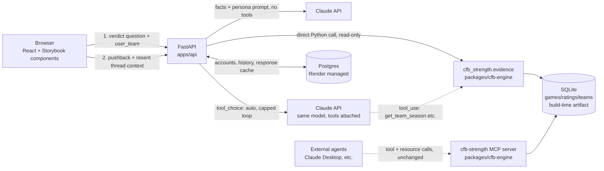

# Architecture Brief — My Team Is Better

Companion to `docs/PRD.md`. Assumes that PRD's scope decisions (structured
questions with a bounded pushback follow-up, 1998–present, Keener-only for MVP).

Where a decision is explicitly borrowed from `claude-architect/docs/exam-guide.md`,
it's cited inline as `(Domain N.M)` — not because the exam matters here, but
because those task statements are a good compressed checklist for exactly the
deterministic-core/AI-layer boundary this product depends on.

---

## 1. System overview



Two separate consumers of the same engine, on purpose:

- **The web app** already knows exactly which deterministic query it needs
  (the UI picked the question type) — it calls `cfb_strength.evidence`
  functions **directly as a Python import**, no tool-calling round trip.
- **The existing MCP server** (still stdio, one addition — see §4.5) stays
  available for agentic consumers that genuinely need to *choose* which tool
  to call — Claude Desktop, other agents. Don't collapse these into one path
  just because they wrap the same engine (Domain 2.3: an agent's tool
  surface should match what that agent actually needs to decide, not be
  maximized).

## 2. Monorepo layout

```
my-team-is-better/
  apps/
    web/            # React + Vite + TS + Storybook (SPA, static build)
    api/             # FastAPI: HTTP endpoints + persona orchestration
  packages/
    cfb-engine/      # cfb-strength-orchestrated, absorbed near-verbatim
      src/cfb_strength/
        ingest/ ratings/ evidence/ mcp_server/ db/ contracts.py config.py cli.py
      .importlinter
      pyproject.toml
  docs/
    PRD.md
    ARCHITECTURE.md
  render.yaml
  pyproject.toml     # uv workspace root
  .github/workflows/ci.yml
```

**uv workspace**, not a separate vendored copy: root `pyproject.toml` declares

```toml
[tool.uv.workspace]
members = ["packages/cfb-engine", "apps/api"]
```

`apps/api` depends on `cfb-strength-orchestrated` as a workspace member (path
dependency, one lockfile). This is why absorbing the engine into the monorepo
(founder's choice over keeping it a separate deployed service) is the right
call for a fast-moving solo project: one CI run, one version of the truth,
and — critically — when the "levers" feature lands later, engine and API
change together in one PR instead of a cross-repo version bump dance.

**Layering stays enforced, just extended.** `apps/api` is a new top-layer
consumer exactly like `cli.py` and `mcp_server/` are today — it may only
import `cfb_strength.evidence` and `cfb_strength.db.connection`, never
`ratings/` or `ingest/` directly. Add a line to `.importlinter` reflecting
this the same way the existing layers contract already separates
`cli`/`mcp_server` from `evidence | ratings | ingest`. `apps/api` living
outside `src/cfb_strength/` means it isn't part of the `import-linter` root
package by default — enforce the boundary by convention (api only imports
from `cfb_strength.evidence.proof` and `cfb_strength.db.connection`, nothing
else) and call it out in code review, since import-linter can't reach across
package boundaries as configured today.

## 3. Data: two stores, two lifecycles

| Store | Contents | Lifecycle | Why |
|---|---|---|---|
| **SQLite** (`cfb-engine`'s existing schema, unchanged) | `teams`, `team_season`, `games`, `ratings`, `ingestion_log` | Rebuilt fresh by the Render **build command** on every deploy | This is reference data — it doesn't change per-request, doesn't need a network round trip, and paying for a managed Postgres instance just to serve read-mostly rankings would be waste for a hobby-budget app. |
| **Postgres** (Render managed) | accounts (via auth provider's user id), favorite team, question history, **persona response cache** | Runtime, mutable, grows with usage | This is genuinely dynamic app state — the one thing that has to be a real database. |

### 3.1 Where the SQLite file actually lives (verified against Render's docs)

Render web services have an **ephemeral filesystem** by default — anything a
running instance writes to disk is gone on the next deploy, restart, or scale
event. [Persistent Disks](https://render.com/docs/disks) exist to survive
that, but they're paid-plan-only (free web services can't attach one at
all) and — critically — **the build command can't see a persistent disk in
the first place**: build and pre-deploy commands run on separate compute
from the running instance ([Render docs](https://render.com/docs/deploys)).

None of that matters here, because we don't need the db to survive anything
— we need it to be *correct*, and it's 100% reproducible from committed
source data. So the plan is:

1. The Render **build command** runs `uv run cfb ingest --years 1998-2025 &&
   uv run cfb rate --years 1998-2025`, which writes `cfb.sqlite3` to
   `packages/cfb-engine/data/` — the same path `config.py`'s `DB_PATH`
   already resolves to locally.
2. That file becomes part of the instance's filesystem for the running
   deploy — build output *is* present when the start command runs, for the
   lifetime of that instance (confirmed: build output is baked into what
   each deployed/scaled instance runs from).
3. A redeploy, restart, or scale-out regenerates it from scratch via the
   same build command. This is a feature, not a gap: every instance is
   guaranteed to be running the exact same reference data with zero drift,
   and the whole reason a persistent disk would even be a candidate here
   (surviving restarts) is moot when regeneration is free and deterministic.
4. **No persistent disk, no Postgres for this data.** The engine already
   opens every connection to it `mode=ro` (`mcp_server/server.py`) — it was
   never going to be written to at runtime anyway.

**The one real cost risk this surfaces**: if the build's ingest step ever
hits the *live* CFBD API instead of the on-disk cache, a hobby dev deploying
several times a day (or Render building independently per scaled instance)
could burn through CFBD's 1,000-calls/month free tier fast. `ingest`
already fetches cache-first from `data/raw/*.json`
(`cfb_strength.ingest.client.get_games`) — so the fix is simply to **commit
`data/raw/` to the repo** (done: ~30MB of cached CFBD JSON for 2000–2023 is
now tracked, `.gitignore` only excludes the derived `cfb.sqlite3` binary).
Every build's ingest step is then a 100% cache hit — zero live API calls per
deploy, regardless of deploy frequency or instance count. A human only
touches the live API deliberately, with `--force`, to add a new season or
fix bad data — then commits the refreshed JSON like any other source change.

(Considered and rejected: committing the built `cfb.sqlite3` binary itself
and skipping ingest at build time entirely. Simpler build step, but couples
"source of truth" to an opaque 44MB blob that's hard to review in a PR and
has to be manually regenerated and recommitted after any ratings-algorithm
change — e.g. when the "levers" feature ships. Committing the JSON and
rebuilding the db deterministically at build time keeps the diffable
artifact in git and the derived one out of it.)

**Known gap to close before this actually works for the full PRD scope**:
`ingest_season.py` currently hardcodes `MIN_YEAR = 2000` / `MAX_YEAR = 2023`
— 1998–1999 and 2024–2025 need that range extended (and freshly ingested)
before the `--years 1998-2025` build command above is accurate. Not a
blocker for this brief, just don't copy that command verbatim into
`render.yaml` without doing it first.

## 4. Backend: FastAPI (`apps/api`)

### 4.1 Request flow for the initial verdict

This is the structured-question path only (PRD §5.1). The follow-up pushback
path (PRD §5.1a) is a deliberately different flow — see §4.6.

1. Client sends `{question_type, year, team | team_a/team_b, user_team}`.
2. API calls the matching `cfb_strength.evidence.proof` function **directly**
   (no MCP, no tool-calling loop) — it already knows exactly which one to
   call because the UI's structured form determined that, not an LLM. Errors
   come back as the contract's existing typed exceptions
   (`UnknownYearError`, `AmbiguousTeamError`, `SameTeamComparisonError`) —
   reuse these as-is rather than inventing new error shapes; they already
   distinguish retryable-shaped problems (bad year → show valid years) from
   genuine input problems (ambiguous team → show candidates), which is
   exactly the distinction Domain 2.2 asks for.
3. API checks the **persona cache** (Postgres) keyed on
   `hash(question_type, year, team(s), user_team, method, prompt_version)`.
   Cache hit → return immediately, no Claude call. This is the single
   biggest cost lever available (PRD §6): the deterministic facts and the
   allegiance are both part of the key, so "Michigan fan asks about 2005"
   only ever generates once, no matter how many Michigan fans ask it.
4. Cache miss → one Claude API call. The evidence dataclass (already
   JSON-serializable via `dataclasses.asdict`, per the existing MCP server
   code) is embedded directly in the prompt as the fact block. **Claude is
   not given tool access for this path** — it has already been handed the
   final, verified facts; giving it tools to "look things up itself" here
   would just add latency, cost, and a failure mode for zero benefit, since
   the backend already did the lookup. (Contrast deliberately with the MCP
   server's consumers, who genuinely need tool choice — Domain 2.3.)
5. Response is validated (§4.3), stored in the cache, returned.

### 4.2 Model choice

Use a Haiku-class model for the persona layer, not Opus/Sonnet. The hard
reasoning (who's actually better) is 100% deterministic and already done by
the time Claude is invoked — its job is voice and personality within a fact
block, which is a much smaller ask than open-ended reasoning. Reserve
spend-per-call for the cache-miss path only.

### 4.3 Keeping the persona honest (Domain 4.1, 4.3, 4.4, 5.6)

The system prompt gives **explicit, checkable criteria**, not vague
instructions like "be accurate" (Domain 4.1 — vague conservatism instructions
don't actually improve precision):

- Every team name, record, and score the persona states must appear in the
  injected fact block — nothing else. State this as a hard rule with 2–3
  few-shot examples of a correct answer next to a *rejected* answer that
  invents a stat (Domain 4.2).
- Include a `contested: bool` field the backend sets for known
  split-decision years (2003, 2017 — the same list already used in
  `cfb-engine`'s validator) and instruct the persona to disclose it in
  character when true, argue it as unambiguous when false.
- **Post-generation check, not just prompt instructions**: extract team
  names/numbers mentioned in the persona's response with a cheap regex pass
  and confirm they're a subset of the fact block's own team names/numbers.
  Fail → one retry with the specific mismatch appended as feedback (Domain
  4.4's retry-with-error-feedback pattern — this works because the failure
  is "said something not grounded," a correctable instruction-following
  slip, not "the information doesn't exist," which retries can't fix
  anyway). Fail twice → serve a safe templated fallback line instead of a
  third Claude call, and log it for prompt iteration.
- Show the underlying evidence (record, quality wins, worst loss, common
  opponents) in the UI alongside the persona's paragraph, always — the
  "receipts" stay visible so a checkable claim never depends solely on
  trusting the model's narration (Domain 5.6: preserve the claim-source
  mapping instead of letting the generation step be the only surface).

### 4.4 Error handling as persona copy (Domain 2.2, 5.3)

The existing MCP server already returns structured, typed errors instead of
generic failures — reuse that distinction directly for user-facing copy:

| Contract error | User-facing behavior |
|---|---|
| `UnknownYearError` | In-character "I got nothing for that year, pal" + list of years that *are* available (never a raw 500) |
| `AmbiguousTeamError` | Show the candidate list, ask the user to pick — not a heuristic guess (mirrors Domain 5.2's "ask for clarification on multiple matches" guidance) |
| `SameTeamComparisonError` | Persona jokes about it, no API/model call made at all |

None of these should ever reach Claude — they're resolved before the persona
call happens, since they're about invalid *input*, not about the persona's
job.

### 4.5 Static catalog data as MCP resources, not tools (Domain 2.4)

`packages/cfb-engine`'s MCP server (`mcp_server/server.py`) now exposes three
**resources** alongside its existing tools — implemented, not just planned:

| Resource | Content | Why a resource, not a tool |
|---|---|---|
| `resource://cfb-strength/seasons` | Every `(year, method)` with computed ratings | Parameter-free catalog data that never changes per-request — a client reads it once instead of spending a tool call on "discovery" every time. Shares its query with the existing `list_seasons` tool (`_season_catalog()`) so there's one source of truth, not two drifting copies. |
| `resource://cfb-strength/teams` | Full team catalog (id, school, classification) | Same reasoning — lets a client resolve/spell-check a team name from static context instead of guessing or round-tripping. |
| `resource://cfb-strength/credits` | Methodology citation (Keener 1993) + data source (CollegeFootballData.com) | Static by nature, and putting it on the resource surface means **any** MCP client that connects — not just this product's own backend — sees the attribution as part of the data contract, not as page copy it can ignore. See PRD §5.6. |

The four existing computed-query tools (`get_rankings`, `get_team_season`,
`compare_teams`, `get_champion`) are unchanged — they take parameters and do
real computation per call, which is exactly what stays a tool rather than a
resource. `list_seasons` also stays as a tool for clients that only support
tool calls; it now just delegates to the same helper the resource uses.

The web app's own hot path (§4.1) still fetches facts via direct Python
import, not a live MCP connection — that decision doesn't change. But its
"How this works / Credits" page (PRD §5.6) and any static team-name/season
data the frontend needs should source from these same `cfb_strength`-level
functions (imported directly, same as the evidence calls) rather than
re-hardcoding a second copy of the team list or the citation text anywhere
in `apps/api` or `apps/web`.

### 4.6 Debate mode: bounded tool-calling for pushback follow-ups (Domain 1.1, 2.3, 5.1)

The verdict flow (§4.1) deliberately gives Claude no tools, because the
backend already knows exactly which fact block it needs. A pushback
follow-up ("what was Ohio State's record in 2007? who'd they play?") is the
opposite case: the question is genuinely open-ended text, so the backend
*can't* know in advance which evidence call answers it. This is exactly the
situation real tool-calling exists for (Domain 2.3), and it's a different
code path from the verdict flow, not a modification of it.

**This is Anthropic tool-use, not MCP.** `apps/api` defines tool schemas
that wrap the same `cfb_strength.evidence.proof` functions the verdict flow
already imports directly (`build_team_case`, `build_comparison`,
`list_available_years`, plus a season-leaderboard lookup) and executes them
itself when Claude returns a `tool_use` block. The MCP server (§4.5) is a
separate, unchanged transport for external agents — this is the product's
own backend handing Claude functions to call, which happens to be the same
underlying Python functions the MCP server also wraps. Don't stand up an
internal MCP client to talk to the internal MCP server; that would be a
network/process hop to reach code already sitting in the same import graph.

**Request shape:** `{original_verdict_context, follow_up_history, new_pushback}`.
The client resends the verdict's fact block and every prior pushback Q&A
pair in the thread (the "case facts block, resent each turn" pattern —
Domain 5.1) — the server still opens and closes a connection per call and
holds no session state for a guest.

**Agentic loop, capped (Domain 1.1):** `tool_choice: "auto"`, and the
backend runs the standard tool-use loop — Claude may call a tool, get the
result appended to context, and decide whether it needs another — but capped
at a small fixed number of tool calls per pushback (e.g. 2–3) before the
backend forces a final answer with whatever it has. An uncapped loop here is
the one place this architecture could genuinely run away on cost; the cap is
the guardrail, not the cache (which doesn't apply well to free text anyway —
PRD §6).

**Honesty check still applies:** the same post-generation grounding check
from §4.3 runs here too, except the allowed fact set is now the original
verdict's fact block *plus* whatever this turn's tool calls actually
returned — still nothing invented, just a larger, dynamically-assembled set
of "things Claude is allowed to have said."

**Not built for MVP unless the founder wants it there day one**: the turn
cap, tool-call cap, and exact tool schema names are implementation details
to settle when this gets built, not open architecture questions — the
pattern above is the answer regardless of when it's scheduled.

## 5. Accounts — guest-first, optional upgrade

No credential is ever required to ask a question (PRD §5.3). This shapes the
backend and data model:

- **`POST /api/ask`-equivalent endpoints are public**, unauthenticated. A
  guest's "my team" selection travels with the request from client-side
  storage (`localStorage`); the backend never requires an identity to answer.
  The persona cache key (§4.1) was already user-id-free — guest mode doesn't
  change it at all.
- **Sign-in is additive**, not a gate: offered as "save your team and history
  across devices." When present, use a managed auth provider (e.g. Clerk)
  rather than building auth — the PRD's days-not-weeks timeline makes custom
  auth the highest-risk way to spend that time. FastAPI verifies the
  provider's JWT only on the routes that need an identity (saving/reading
  history); every other route works with no token at all.
- Postgres stores only `(provider_user_id, favorite_team, created_at)` plus a
  `question_history` table keyed on that id — rows that simply don't exist
  for guests. No password handling, no session infrastructure to build, and
  no feature is unreachable without an account.

## 6. The engine: no changes needed for MVP, one seam to protect for v2

`RatingMethod` (in `contracts.py`) is already a `Protocol` — `keener.py` is
one implementation behind it. This is exactly the seam the "levers" feature
(PRD §4 future state) will use: a future `TunableKeener` (or similarly named)
implementation taking a weights config, registered as a second `method`
value alongside `"keener"` in the `ratings` table (the schema's
`UNIQUE(year, method, team_id)` and `method TEXT` column already anticipate
more than one method existing side by side — no schema change required to
add one). For MVP: **do not build this.** Ship stock Keener only, keep the
seam in mind, don't speculatively build the weighting UI or backend plumbing
until the founder decides to spend the time on it.

## 7. Deployment (Render)

Single `render.yaml` blueprint:

- **Static site** — `apps/web` build output.
- **Web service** — `apps/api` (FastAPI via uvicorn), **entry-level Starter
  plan (~$7/mo)**, not free — build step runs
  `uv run cfb ingest --years 1998-2025 && uv run cfb rate --years 1998-2025`
  against the committed `data/raw/` cache (§3.1) so the SQLite reference
  data is baked into every deploy with zero live CFBD calls.
- **Postgres** — Render managed instance, **entry-level paid plan
  (Basic-256mb, ~$6–7/mo) from day one**, for accounts/history/persona
  cache.

**Two Render tier facts that drove both paid-plan decisions, verified
against current pricing and policy:**

| Render tier fact | Impact here | Resolution |
|---|---|---|
| Free Postgres **expires 30 days after creation** (14-day grace period, then deleted; no backups; [Render changelog](https://render.com/changelog/free-postgresql-instances-now-expire-after-30-days-previously-90)) | Unacceptable for durable account/history data — a free Postgres would silently wipe user accounts every ~44 days | **Resolved**: entry-level paid Postgres from day one (~$6–7/mo, [pricing](https://render.com/docs/free)). Guest mode still doesn't need it at all — the cost only buys durability for the optional account layer. |
| Free web services **spin down after 15 min idle**, ~30–60s cold start on the next request ([Render docs](https://render.com/docs/free)) | A demo link sent to a technical interviewer could hang for a minute on first click — a bad first impression for a portfolio piece (PRD §6) | **Resolved**: entry-level Starter instance (~$7/mo) keeps it always warm — worth it given "demoable" is an explicit non-functional requirement (PRD §6). |

**Confirmed running cost: ~$13–14/month** (Postgres + web service, both
entry-level paid tiers), independent of Claude API usage (PRD §6's
cache/model-choice cost controls still apply on top of this) and independent
of the domain (`my-team-is-better.lol`, already purchased separately).

Environment variables: `ANTHROPIC_API_KEY`, `CFBD_API_KEY` (build-time
ingest only, not needed at runtime), `DATABASE_URL` (Postgres), auth
provider secret.

## 8. CI (`.github/workflows/ci.yml`)

Extends the engine's existing checks rather than replacing them:

- `packages/cfb-engine`: `uv run pytest`, `uv run mypy --strict
  src/cfb_strength/contracts.py`, `uv run lint-imports` (all pre-existing,
  keep as-is).
- `apps/api`: `pytest` for endpoint tests, mocking the Claude call.
- `apps/web`: type-check, unit tests (Vitest), **Storybook build** as a CI
  gate (not just local dev) — since Storybook is a stated skill-building
  goal in its own right, treat a broken Storybook build as a CI failure,
  not an afterthought.
- **Persona smoke eval**: a small fixed prompt set (the same golden-dataset
  years: 2001, 2004, 2005, 2013, 2019, plus 2003/2017 for contested-case
  copy) run through the real persona pipeline, asserting: correct #1 team
  named, no team/number outside the fact block, response length bounded,
  no banned-word hits. This is the persona's answer to Domain 4.6's
  "independent review instance" idea — a cheap automated check standing in
  for the human review loop this project doesn't otherwise have.

## 9. Explicit non-goals for this brief

- No server-side session state, for either flow — the verdict path is
  stateless by design (§4.1), and the pushback path stays stateless-per-
  request by having the client resend thread context rather than the
  backend holding a session (§4.6, PRD §5.4).
- No agent-choosing-tools path for the **verdict** flow specifically (§4.1)
  — that's still a hard rule. The pushback flow (§4.6) is the one
  intentional exception, and it's capped, not open-ended.
- No new database engine or ORM decision beyond "Postgres for mutable app
  state, SQLite for the deterministic reference dataset" — don't add Redis,
  a queue, or a vector store; nothing here needs them yet.
